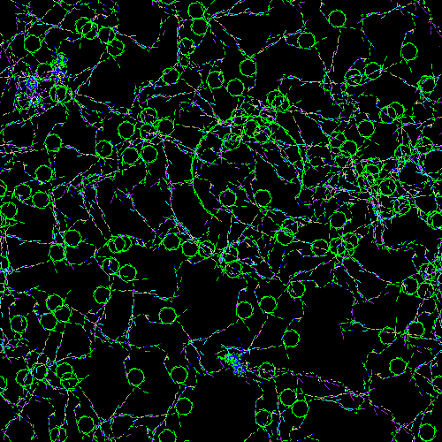

Necessary ingredients include a C compiler, make, ucblogo, a source of
data--/dev/random, code libraries, `hexdump -C` on binary date, etc--
place this data into the "input" file--and time to fiddle around with
the input and various parameters in the C code.

Packages for OpenBSD:

  pkg_add feh scrot ucblogo

Example usage:

  dd if=/dev/random of=input bs=512 count=3; make

Favorable results tile, so may be suitable as e.g. a desktop
background, assuming OpenBSD and zsh with setopt EXTENDED_GLOB, one
might select and set those via:

  scrot -s; feh --bg-tile *.png(om[1])

In particular, the code will favor input braced with ([{< pairs which
cause the data within to be repeated on. Each character of input
otherwise has an associated value, and various LOGO actions carried out
depending on the value.

